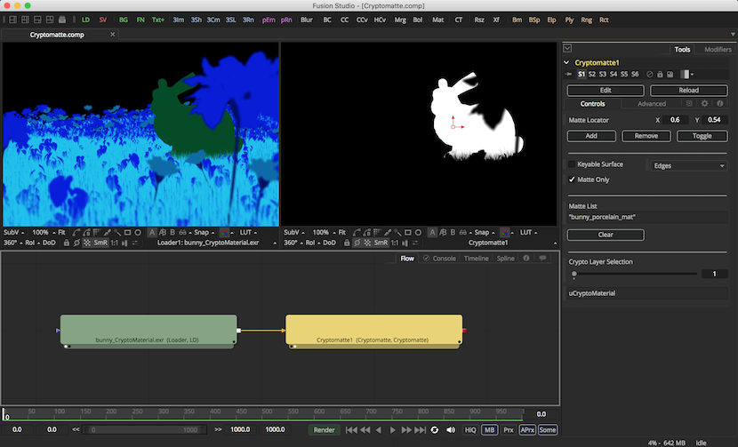

## Fusion Installation

1. Download the entire Cryptomatte GitHub repository using the green "Clone or download" button. Select "Download Zip" and then extract the contents.
2.  Copy the `fusion/Modules/Lua/cryptomatte_utilities.lua` module into the standard Fusion Lua "package.path" location. The Lua modules can also be added to a folder that is listed in your `LUA_PATH` based environment variable.
    * Windows : `C:\Program Files\Blackmagic Design\Fusion 9\lua\`
    * Linux : `/usr/local/share/lua/5.1/`
    * Mac : `/usr/local/share/lua/5.1/`
3. Copy the `fusion/Fuses/Matte/cryptomatte.fuse` file into the Fusion user preferences based `Fuses:/` PathMap directory, or the "Fuses" subfolder in the Fusion installation folder.
    * Windows : `C:\Program Files\Blackmagic Design\Fusion 9\Fuses\`
    * Linux : `/opt/BlackmagicDesign/Fusion9/Fuses/`
    * Mac : `/Applications/Blackmagic Fusion 9/Fusion.app/Contents/MacOS/Fuses/`
4. Copy the `fusion/Config/cryptomatte_shortcut.fu` file into the Fusion user preferences based `Config:/` PathMap directory, or the "Config" subfolder in the Fusion installation folder.
    * Windows : `C:\Program Files\Blackmagic Design\Fusion 9\Config\`
    * Linux : `/opt/BlackmagicDesign/Fusion9/Config/`
    * Mac : `/Applications/Blackmagic Fusion 9/Fusion.app/Contents/MacOS/Config/`

### Fusion Usage:

The Cryptomatte Fuse works in Fusion (Free) and Fusion Studio v9.0.2+. The Fuse allows you to create matte selections using a Cryptomatte "Matte Locator" control that is positioned using transform control the Fusion Viewer window.

To get started:

1. Add a Cryptomatte exr file to your composite, such as the sample images, using a Loader node. 
2. Select the Loader node and use the Select Tool window (Shift + Spacebar) to add a new Cryptomatte node to your composite.
3. Select the Cryptomatte node in the Flow area and display the output in a Viewer window.
4. Position the Cryptomatte "Matte Locator" control in the Viewer window over an object in the frame.
5. Press the "Add" button in the Cryptomatte Tools view to add a new matte entry to the Matte List. Alternatively, you could press the "Shift + T" hotkey in the Fusion Viewer window to toggle the active Cryptomatte "Matte Locator" state between the "Add" and "Remove" selection modes.

### Cryptomatte Fuse

