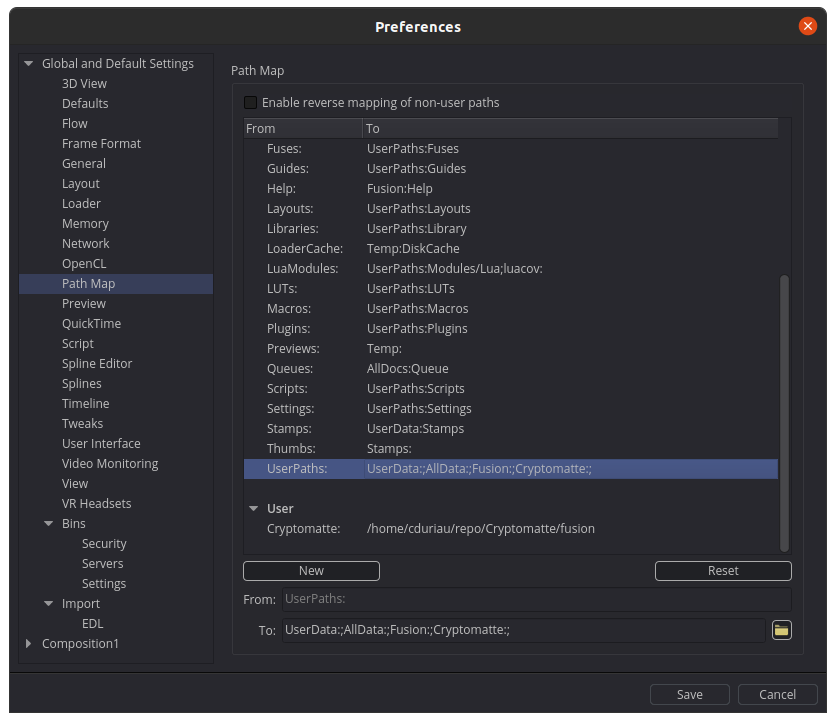

## Fusion Installation

1. Download the entire Cryptomatte GitHub repository using the green `Code` button. Select `Download ZIP` and then extract the contents.

2. Open Fusion and open the path mapping preferences.

    - `File` > `Preferences` > `Global and Default Settings` > `Path Map`

3. Add to the `User` section by clicking `New` to create a new path mapping entry. Fill in the settings as follows. Replace `{CRYPTOMATTE_DIRECTORY}` with the path to the downloaded and extracted Cryptomatte repository. (See screenshot `User` below.)

    - From: `Cryptomatte:`
    - To: `{CRYPTOMATTE_DIRECTORY}/fusion`

4. Add the newly created path map by selecting the `Defaults` section `UserPaths:` entry as following. (See screenshot `Defaults` below.)

    - From: `UserPaths:`
    - To: `UserData:;AllData:;Fusion:;Cryptomatte:;`


User | Defaults
:----: | :--------:
 | 

NOTE: If you copied files from previous releases into their respective Fusion supported directories, remove them to avoid conflicts with path mapping.

## Fusion Usage


The Cryptomatte Fuse works in Fusion (Free and Studio) v9.0.2+. The Fuse allows you to create matte selections using a Cryptomatte "Matte Locator" control that is positioned using the transform control in the Fusion Viewer window.

To get started:

1. Add a Cryptomatte exr file to your composite, such as the sample images, using a Loader node. 
2. Select the Loader node and use the Select Tool window (Shift + Spacebar) to add a new Cryptomatte node to your composite.
3. Select the Cryptomatte node in the Flow area and display the output in a Viewer window.
4. Position the Cryptomatte "Matte Locator" control in the Viewer window over an object in the frame.
5. Press the "Add" button in the Cryptomatte Tools view to add a new matte entry to the Matte List. Alternatively, you could press the "Shift + T" hotkey in the Fusion Viewer window to toggle the active Cryptomatte "Matte Locator" state between the "Add" and "Remove" selection modes.

### Cryptomatte Fuse

Controls Tab | Advanced Tab
:-----------------: | :-----------------:
 | 

Controls:
- Matte Locator: Defines the position of the matte to interact with.
- Add: Adds the name of the matte at the current position of the locator to the matte list.
- Removes: Removes the name of the matte at the current position of the locator from matte list.
- Toggle: Adds/Removes the name of the matte at the current position of the locator to/from matte list.
- View Mode: Image to pick mattes on.
  - Colors: Unique colors per matte.
  - Edges: Input image with a colored border around mattes.
  - Beauty: Input image.
  - Matte: Monochannel matte image.
- Matte List: A list of names to extract mattes from. This list may be modified in text form or using the controls.
- Clear: Clears the matte list.
- Layer Index: Index of the Cryptomatte EXR layer to use. Automatically set, can be changed manually.
- Layer Name: Name of the Cryptomatte EXR layer for current index.

Advanced:
- Name Checker Locator: Defines the position of the matte to interact with.
- Show: Shows the name checker locator.
- Hide: Hides the name checker locator.
- Matte Name: Name of the matte at the current name checker locator position.

## Logging

Cryptomatte has a multi-level logging system which notifies the user in case of errors, warnings and process information. There are three log levels supported: `ERROR`, `WARNING` and `INFO`.

To control the log level, determining what is printed in the console, you can set the `CRYPTOMATTE_LOG_LEVEL` environment variable as following. When no log level is set, `WARNING` is used as default.

Log Level   | Value
---------   | -----
ERROR       | 0
WARNING     | 1
INFO        | 2

```lua
-- example error
[Cryptomatte][Cryptomatte1][ERROR] unknown view mode: 'nil'
...Cryptomatte/fusion/Modules/Lua/cryptomatte_utilities.lua:614: ERROR
stack traceback:
	[C]: in function 'error'
	...Cryptomatte/fusion/Modules/Lua/cryptomatte_utilities.lua:614: in function 'log_error'
	...iau/repo/Cryptomatte/fusion/Fuses/Matte/cryptomatte.fuse:403: in function <...iau/repo/Cryptomatte/fusion/Fuses/Matte/cryptomatte.fuse:249>
Cryptomatte1 failed at time 0
```
```lua
-- example warning
[Cryptomatte][Cryptomatte1][WARNING] matte not present in manifest: foo
```
```lua
-- example info
[Cryptomatte][Cryptomatte1][INFO] -- process started
[Cryptomatte][Cryptomatte1][INFO] reading metadata ...
[Cryptomatte][Cryptomatte1][INFO] setting layer name: 'uCryptoAsset'
[Cryptomatte][Cryptomatte1][INFO] decoding manifest ...
[Cryptomatte][Cryptomatte1][INFO] creating layer images ...
[Cryptomatte][Cryptomatte1][INFO] reading matte names ...
[Cryptomatte][Cryptomatte1][INFO] creating matte image ...
[Cryptomatte][Cryptomatte1][INFO] creating 'Colors' preview image ...
[Cryptomatte][Cryptomatte1][INFO] elapsed time: 2.202
[Cryptomatte][Cryptomatte1][INFO] -- process ended
```

## Testing
Cryptomatte for Fusion ships with two lua modules.

1. `cryptomatte_utilities.lua`
2. `test_cryptomatte_utilities.lua`

The first being the utility module for the Fuse, the second is its test suite. This test suite was written to test and ensure functionalities are working and behave in an expected manner.

The test suite is only used for development and **completely optional** for a functional Cryptomatte Fuse. If you wish to run the test suite yourself, you can do so by running the following snippet in the Fusion Lua script console.

```lua
-- replace {PATH_TO_TEST_FILE} with the absolute path to the test file
dofile("{PATH_TO_TEST_FILE}")
```
```lua
-- example run
dofile("/home/cduriau/repo/Cryptomatte/fusion/Modules/Lua/test_cryptomatte_utilities.lua")
collectings test(s) ...
detected 18 test(s) ...
running tests ...
[  6%] cryptomatte_test__format_log ...                      [OK]
[ 11%] cryptomatte_test__get_absolute_path ...               [OK]
[ 17%] cryptomatte_test__get_absolute_position ...           [OK]
[ 22%] cryptomatte_test__get_channel_hierarchy ...           [OK]
[ 28%] cryptomatte_test__get_log_level ...                   [OK]
[ 33%] cryptomatte_test__hex_to_float ...                    [OK]
[ 39%] cryptomatte_test__is_position_in_rect ...             [OK]
[ 44%] cryptomatte_test__solve_channel_name ...              [OK]
[ 50%] cryptomatte_test__string_ends_with ...                [OK]
[ 56%] cryptomatte_test__string_split ...                    [OK]
[ 61%] cryptomatte_test__string_starts_with ...              [OK]
[ 67%] cryptomatte_test_decode_manifest ...                  [OK]
[ 72%] cryptomatte_test_get_cryptomatte_metadata ...         [OK]
[ 78%] cryptomatte_test_get_matte_names ...                  [OK]
[ 83%] cryptomatte_test_log_error ...                        [OK]
[ 89%] cryptomatte_test_log_info ...                         [OK]
[ 94%] cryptomatte_test_log_warning ...                      [OK]
[100%] cryptomatte_test_read_manifest_file ...               [OK]
```
