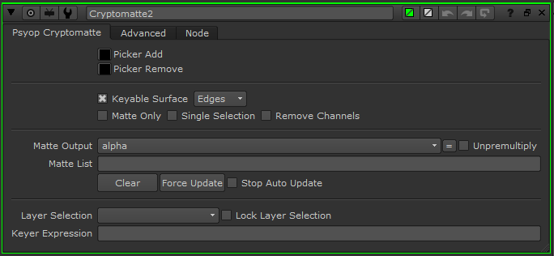
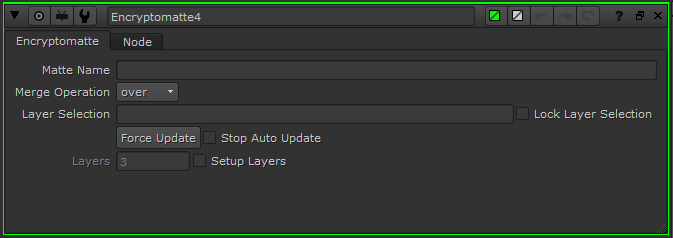

## Nuke Installation

1. Download the entire Cryptomatte GitHub repository using the green "Clone or download" button. Select "Download Zip" and then extract the contents.
2. Copy the contents of the "nuke" folder from Cryptomatte into a folder in your Nuke plugin path, such as your home directory's ".nuke" folder.
3. If the destination folder already contains an "init.py" and/or "menu.py" file, open those files in a text editor, and append the contents of the Cryptomatte "init.py" and "menu.py" to those files.
4. After launching Nuke, if you've installed the plugin correctly you should be able to tab-create a Cryptomatte gizmo.

For more information on installing Nuke plugins, see:

[https://www.thefoundry.co.uk/products/nuke/developers/105/pythondevguide/installing_plugins.html](https://www.thefoundry.co.uk/products/nuke/developers/105/pythondevguide/installing_plugins.html)

To test the functionality, you can try loading one of the sample images supplied. Load the sample images into Nuke, select one of them, and tab-create the gizmo. Viewing the output of the gizmo should show you a preview of the available mattes. Use the color knob, "Picker Add" to eye-dropper colors on the image to create your mattes.

## Nuke Usage


To get started: 

1. Load a Cryptomatte exr file, such as the sample images, using a Read node.
2. Select it, and tab create a Cryptomatte gizmo.
3. View the output of the gizmo. You should see a preview image (pictured).
4. Use the eyedropper with the 'Picker Add' knob to select objects. They should light up in RGB, and output the matte in Alpha. With the eyedropper, make sure you use control-click and not alt-control click.

### Cryptomatte Gizmo



Psyop Cryptomatte Tab:

* Picker Add: This adds "keyed" objects to the matte selection, meant to be used with Nuke's eyedropper.
* Picker Remove: This removes "keyed" objects from the matte selection, meant to be used with Nuke's eyedropper.
* Preview: Controls whether or not previews of the matte boundaries are drawn. A pulldown controls how they are drawn.
  * "Edges" allows viewing input RGBA with borders around keyable regions
  * "Colors" is random colors per matte
  * "None" allows viewing of input RGBA without borders, but with a visible highlight on selected areas
* Matte Only: Also write the matte to RGBA channels
* Single Selection: Changes the gizmo behavior so that only one object may be selected at a time.
* Remove Channels: Removes the Cryptomatte channels so that downstream of the gizmo, the additional channels are not present.
* Matte Output: Which channel the extracted matte is written to.
* Unpremultiply: Unpremults the extracted matte against by the alpha.
* Matte List: A list of names to extract mattes from. This list may be modified in text form or using the Picker color knobs.
* Clear: Clears the matte list.
* Force Update: The python scripts keep Cryptomatte gizmos updated when inputs or relevant knobs are changed. If there's a case that it does not update, this button will manually update it.
* Stop Auto Update: Stops the automatic updating described above.
* Layer Selection: If there are multiple Cryptomattes, this is how you select the layer. This is filled in automatically, but may be changed manually.
* Lock Layer Selection: Stops the automatic updating of layer selection, which occurs if the specified selection is not available.
* Expression: Internally the gizmo generates an expression to extract the matte. The expression is saved here.

Advanced Tab:

* Decryptomatte: Replaces gizmo with equivalent nodes
* Unload Manifest: Generates a keyer for every name in the manifest.
* Force Update All Gizmos in Script: Same as "Force Update", but runs the force update functionality on all Gizmos in the script.

### Encryptomatte Gizmo



Encryptomatte is a gizmo that can modify existing Cryptomattes, or start new ones. One Encryptomatte node adds one matte to a Cryptomatte.

To get started:

1. Load a Cryptomatte with a read node. 
2. Select it, and tab-create an Encryptomatte. 
3. Feed in a matte that you would like to add to that Cryptomatte. You can put it over or under all other mattes.
4. Write it out as a 32 bit EXR with all metadata, or attach a Cryptomatte node to it to test the mattes.

Encryptomatte tab:

* Matte Name: The name your new matte will have in the Cryptomatte
* Merge Operation: Where in the stack of mattes your matte will be added, over or under the rest
* Layer selection: Same as Cryptomatte, see above.
* Force Update: Same as Cryptomatte, see above.
* Layers: If starting a fresh Cryptomatte, sets how many Cryptomatte layers are to be created. If starting from scratch, fill in Layer Selection manually.
* Setup Layers: If on, starts a fresh Cryptomatte. Otherwise, modifies one from the input.

### Menu options

* Cryptomatte: Creates a Cryptomatte gizmo
* Decryptomatte All: Replaces all Cryptomatte gizmos with other nodes which are functionally equivalent. This is useful for sending nuke scripts to other users who do not have the Cryptomatte plugins installed.
* Decryptomatte Selected: Same as "decryptomatte all", except only applies to selected nodes. 
* Encryptomatte: Creates an Encryptomatte gizmo

### Troubleshooting

A couple of really simple things to watch out for:

* Make sure you are viewing the same Cryptomatte gizmo you're keying with. (this is a very easy mistake to make).
* To use the eyedropper, use the control key. Do not use alt-control, which eyedroppers values from upstream of the node. Many users are in the habit of using alt-control eye droppering.

### Troubleshooting button

The advanced tab of the gizmo has a "Troubleshoot" button that will test for common installation and setup problems. 

### Common issues

#### Keyed mattes have incorrect pixelated edges.

Make sure there are no "Reformat" or "LensDistortion" or similar nodes applied to your Cryptomattes before trying to key them. Cryptomatte relies on exact values in channels, and operations that mix values with neighboring values will damage this information, resulting in only being able to extract mattes on pixels containing only one object. These operations should be applied to the extracted mattes instead.

Likewise, using proxy mode gives bad results for similar reasons.

#### Things key properly, but not as their names, instead they key as numbers like `<0.1234>`

The object keyed is not in the manifest provided with this EXR file, or no manifest is provided. This is a problem on the 3D side. However, objects keyed this way will be stable and will work.

#### I can't tab-create the Cryptomatte gizmo.

The scripts are not installed correctly. See installation instructions.

#### I don't get a keyable surface when I connect my gizmo to a read node.

Try running, "Force Update". If an error dialogue box pops up, the scripts are not installed correctly. See installation instructions.

Also, test if it works on one of the sample images.

#### Objects under the Arnold watermark aren't keyable.

They sure aren't!

#### I can't key the background (black pixels).

You can key the background by manually entering the value, `<0.0>` into the matte list of the gizmo.

### Testing (developers)

Nuke Cryptomatte has a suite of unit and integration tests. These cover hashing, CSV resolution, operations of the Cryptomatte and Encryptomatte gizmos, and Decryptomatte. Use of these is strongly encouraged if working with the Cryptomatte code.

```
# To run tests in an ad-hoc style in a Nuke session, in the script editor: 
import cryptomatte_utilities as cu
cu.tests.run_nuke_tests()
```

Tests require the provided `sample_images` directory. If it is not located in the default location relative to the Python files, its location may be specified using an env variable, `$CRYPTOMATTE_TESTING_SAMPLES`. This can also be done ad-hoc in Nuke prior to running tests:

```
import os
os.environ["CRYPTOMATTE_TESTING_SAMPLES"] = "" #  < specify sample_images dir here
```
